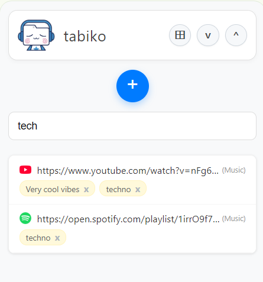
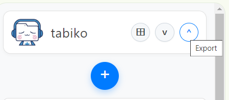
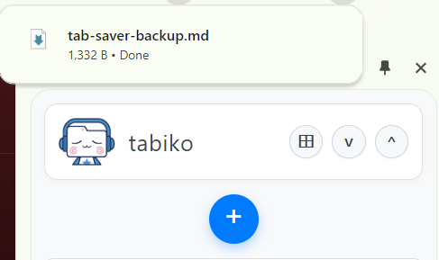
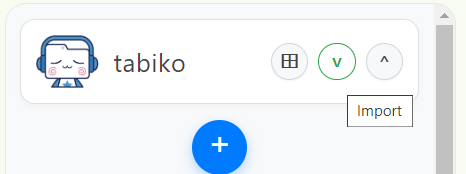
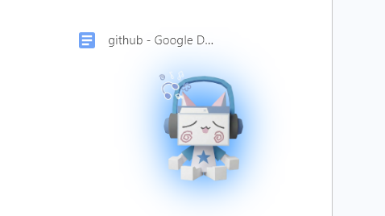

 (˶˃ ꒳ ˂˶)

#  tabiko

> **★ vibe reupload ★**

ur cozy space to manage tabs & notes. keep it organized, keep it cute.  
no more chaotic browser windows, just zen. ₍^. .^₎⟆

> [!NOTE]
> i removed tabiko from the chromestore because i want to move on. so here it is in opensource! if you find a bug, feel free to open an issue ♡

---

### features ˚ ༘♡ ⋆｡˚

<strong>1 Add ur first workspace</strong>

name it, export it and manage it hehe. you can add and move links between workspaces and add as many as your soul desires ✦

<strong>various notes & smart index</strong>

and thanks to smart index, you can find your links across your workspaces based on your notes and/or link titles! you can also save current windows with tabs as links:

<strong>export ur tabs</strong>

export your tabs in a convenient `.md` format (convenient for text and if you use obsidian)

similarly, you can import workspaces with links and notes simply by preserving the format:

<strong>q buddy</strong>

and now you have q buddy! you can give it links and it will save them for you

 
yay! 

---

## Tech Stack
- 
- 
- 
- 

---

made with <3  

Take control of your browser with tabiko. Tab manager with built-in notes and mini-workspaces ₍₍⚞(˶˃ ꒳ ˂˶)⚟⁾⁾

